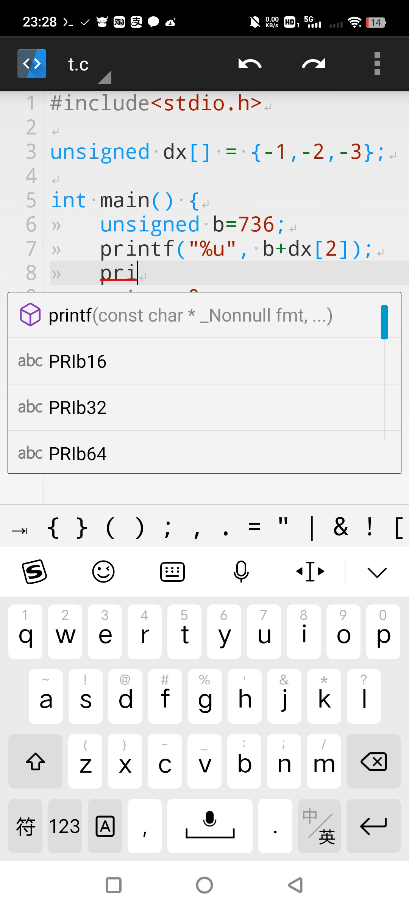

# TermuC

  

[中文 README](./README_zh.md)

TermuC is a simple C/C++ IDE backed on Termux. Based on [MrIkso/CodeEditor](//github.com/MrIkso/CodeEditor)

## Download

- Artifacts in [Github Actions](//github.com/RainbowC0/TermuC/actions)
- [F-Droid](//f-droid.org/packages/cn.rbc.termuc)

## Screenshot

## Technology

This app uses `com.termux.RUN_COMMAND` to call Termux to run command, and run `clangd` language server with `netcat`, which builds an insistent I/O channel, offering functions as diagnosing and compilation.

## Features

- [x] Highlighting
- [x] Autocompletion
- [x] Formatting
- [x] Diagnosing
- [x] Compile flags
- [x] Dark mode
- [x] Debugging
- [x] Project management
- [x] Code action
- [x] Semantic highlighting
- [x] Goto definition
- [x] Symbol renaming
- [ ] Workspace

## Wiki

- [*Setup* (Critical)](//github.com/RainbowC0/TermuC/wiki/Setup)
- [Usage](//github.com/RainbowC0/TermuC/wiki/Usage)
